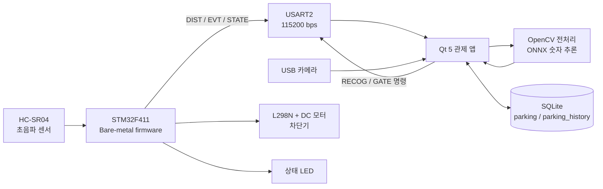
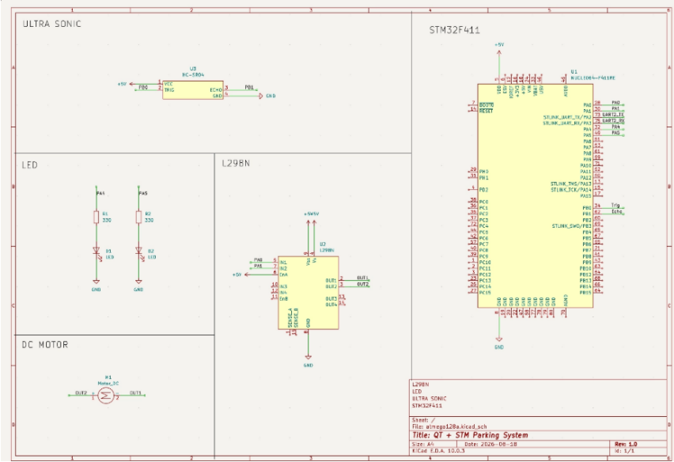

# STM32 기반 스마트 주차 관제 시스템

> 초음파 센서로 차량을 감지하고, USB 카메라의 4자리 숫자를 로컬에서 인식한 뒤, 입·출차 기록과 차단기를 연동한 팀 프로젝트

## 프로젝트 개요

| 항목 | 내용 |
|---|---|
| 프로젝트 성격 | 임베디드·데스크톱 통합 PoC(기능 검증용 시제품) |
| 개발 인원 | 4명: 권민지, 김선호, 김승환, 이규현 |
| 저장소 구현 기록 | 2026-08-14 ~ 2026-08-19 |
| MCU | STM32F411, Arm Cortex-M4F, 96 MHz |
| 펌웨어 | Bare-metal C, CMSIS, 레지스터 직접 제어, ARM GNU Toolchain |
| 호스트 앱 | C++17, Qt 5 Widgets, Qt SerialPort, Qt Multimedia |
| 영상·추론 | USB 카메라, OpenCV DNN, ONNX(MNIST 숫자 분류 모델) |
| 데이터 | SQLite, 현재 주차 상태 및 입·출차 이력 |
| 통신 | USART2, 115200 bps, 8-N-1, ASCII line protocol |

이 프로젝트의 목표는 센서 한 개를 제어하는 데서 끝나지 않고, `감지 → 인식 → 입·출차 판단 → 기록 → 차단기 제어`가 실제 하드웨어와 GUI 사이에서 한 흐름으로 이어지는 시스템을 만드는 것이었다.

## 시스템 구성

### 하드웨어 회로도

KiCad로 작성한 회로도에는 STM32F411과 HC-SR04, L298N, DC 모터, 상태 LED의 연결을 정리했다. 펌웨어에서 사용하는 PA0·PA1 모터 PWM, PA4·PA5 LED, PB0 TRIG, PB1 ECHO 핀을 실제 배선과 함께 확인할 수 있다.

### 동작 흐름

1. STM32가 60 ms 간격으로 초음파 측정을 시작한다.
2. 10 cm 이하 값이 3회 연속 확인되면 `EVT DETECT <거리>`를 Qt 앱에 전송한다.
3. Qt 앱은 USB 카메라의 중앙 ROI를 캡처하고 OpenCV DNN으로 4자리 숫자를 추론한다.
4. SQLite의 현재 주차 상태를 조회해 입차인지 출차인지 결정한다.
5. 사용자가 내용을 확인하면 DB를 트랜잭션으로 갱신하고 `GATE OPEN`을 전송한다.
6. STM32는 차단기를 열고 차량이 통과할 때까지 감시한 뒤 닫으며, 완료 또는 방해물 타임아웃 이벤트를 앱에 전달한다.

## 핵심 구현

### 1. STM32 Bare-metal 펌웨어

- HAL이나 RTOS 없이 RCC, GPIO, TIM, EXTI, USART, NVIC 레지스터를 직접 설정했다.
- TIM2를 1 MHz free-running counter로 사용해 초음파 ECHO 펄스 폭을 마이크로초 단위로 측정했다.
- SysTick 1 ms tick과 메인 루프의 cooperative handler 구조를 조합했다.
- USART2 RX 인터럽트에서는 수신 바이트를 32-byte ring buffer에 넣고, 명령 파싱은 메인 루프에서 수행해 ISR 작업을 줄였다.
- `US_ON → US_OFF → MOTOR` 시스템 상태와 `IDLE → OPENING → HOLD → WAITING → CLOSING` 차단기 상태를 분리했다.
- TIM5 CH1/CH2의 20 kHz PWM과 L298N H-bridge로 DC 모터 방향을 제어했다. 실제 시제품 출력은 70% duty로 고정했다.

### 2. 센서 오검출과 차단기 안전 처리

- 차량 진입은 10 cm 이하, 이탈은 15 cm 이상으로 서로 다른 임계값을 사용해 경계 구간의 채터링을 줄였다.
- 단일 측정값이 아니라 같은 조건이 3회 연속 확인되어야 상태를 바꾼다.
- 차단기 개방 후에는 센서를 다시 사용해 경로가 20 cm보다 멀어진 상태를 3회 확인한 뒤 닫는다.
- 센서 이상으로 영구 대기하지 않도록 30초 타임아웃을 두고 `EVT GATE OBSTRUCTED`를 보고한다.
- 모터 방향 전환 전 두 PWM 출력을 먼저 0으로 만들어 H-bridge의 즉시 역전환을 피했다.

### 3. Qt 관제 앱과 직렬 프로토콜

- `QSerialPort::readyRead`에서 수신 데이터를 누적하고 줄바꿈 단위로 파싱한다.
- 하드웨어가 연결되면 거리, 감지 상태, 펌웨어 상태와 송수신 로그를 실시간으로 표시한다.
- 하드웨어가 없을 때도 UI 흐름을 확인할 수 있도록 차단기 동작 시간만 모사한다.
- 카메라 목록의 description/device metadata에서 외장 카메라 후보를 우선 선택하고, 식별하지 못하면 두 번째 카메라를 fallback으로 사용한다.
- 인식 실패 시 경고창을 닫으면 뒤의 인식 진행 dialog도 함께 종료되도록 실패 흐름을 정리했다.

주요 프로토콜은 다음과 같다.

| 방향 | 메시지 | 의미 |
|---|---|---|
| Qt → STM32 | `RECOG START` | 감지 스캔 중지, 인식 단계 진입 |
| Qt → STM32 | `RECOG CANCEL` | 인식 취소, 센서 스캔 재개 |
| Qt → STM32 | `GATE OPEN` | 차단기 시퀀스 시작 |
| STM32 → Qt | `DIST <cm>` | 거리 측정값 |
| STM32 → Qt | `EVT DETECT <cm>` | 차량 감지 |
| STM32 → Qt | `EVT CLEAR` | 차량 이탈 |
| STM32 → Qt | `EVT GATE DONE` | 차단기 동작 완료 |
| STM32 → Qt | `EVT GATE OBSTRUCTED` | 경로 감지 타임아웃 |
| STM32 → Qt | `STATE <name>` | 현재 시스템 상태 |

### 4. 로컬 영상 처리와 ML 추론

- Qt Multimedia가 전달한 프레임을 별도 `CameraThread`에서 관리해 GUI와 카메라 수명주기를 분리했다.
- 화면 중앙의 300×120 ROI에 grayscale, Gaussian blur, Otsu 이진화를 적용했다.
- contour 크기 조건으로 숫자 후보를 거른 뒤 x 좌표로 정렬한다.
- 각 숫자를 정사각형 padding, 28×28 resize, 0~1 정규화한 다음 ONNX 모델로 분류한다.
- 네 개의 숫자 후보가 모두 검출된 경우에만 결과를 반환하고, 조건이 맞지 않거나 OpenCV 예외가 발생하면 빈 결과로 실패 처리한다.

여기서 사용하는 모델은 `mnist_model.onnx`이며 현재 파일 크기는 1,690,460 bytes다. 카메라 영상은 외부 서버로 보내지 않고 앱이 실행되는 PC에서 처리한다.

### 5. SQLite 입·출차 이력

- `parking` 테이블은 현재 주차 차량을 관리하고, `parking_history`는 입차·출차·생성·수정 시각을 보관한다.
- 입차와 출차 시 현재 상태와 이력 변경을 하나의 SQLite transaction으로 묶어 중간 실패 시 rollback한다.
- 조회 기간과 실제 주차 구간이 겹치는 차량을 찾기 위해 `in_time <= 조회 종료` 및 `out_time IS NULL OR out_time >= 조회 시작` 조건을 사용했다.
- 앱 재시작 시 SQLite에서 현재 주차 차량을 다시 읽어 점유 수량을 복원한다.

## 팀 역할

| 구성원 | 담당 내용 |
|---|---|
| 권민지 | 공동 기획, SQLite DB 연동 및 ML 모델 개발 |
| 김선호 | 공동 기획, FSM 설계, USART2 통신 경로 정비, 펌웨어 Handler·상태·protocol 리팩터링 |
| 김승환 | 공동 기획, 초기 STM32·Qt 개발 기반 구성, USB 카메라·DB·ML 통합 및 후속 보완 |
| 이규현 | 공동 기획, 설계 기반 STM32·Qt 주차 시스템의 1차 통합 구현 |

## 결과

| 확인 항목 | 현재 확인값 | 구분 |
|---|---:|---|
| 펌웨어 빌드 | ARM GNU Toolchain, `-O2`, ELF/BIN 생성 | 빌드 확인 |
| Flash 사용량 | 3,896 bytes / 512 KiB, 약 0.74% | `text + data` 실측 |
| RAM 사용량 | 128 bytes / 128 KiB, 약 0.10% | `data + bss` 실측 |
| 초음파 처리 주기 | 측정 60 ms, 거리 보고 100 ms, 타이머 분해능 1 μs | 코드 설정값 |
| 차량 감지 판정 | 60 ms 간격으로 3회 연속 확인, 이론상 약 180 ms | 계산값 |
| 차단기 시퀀스 | 고정 동작 5초, 장애물 대기 포함 최대 약 35초 | 코드 설정값 |
| 직렬 통신 | COM9, 115200 bps, 8-N-1 거리 로그 확인 | 실기 확인 |
| 외장 카메라 | `USB2.0 PC CAMERA` 선택 상태 확인 | 실기 확인 |
| ONNX 모델 | 1,690,460 bytes, 약 1.61 MiB | 파일 실측 |
| Qt 실행파일 | 219,648 bytes, 약 214.5 KiB | Qt·OpenCV DLL 제외 |
| DB 조회 | 날짜 범위와 주차 기간이 겹치는 차량 목록 표시 | 기능 확인 |
| DB 영속성 | 기존 SQLite 파일을 재사용해 앱 재실행 후 현재 차량 복원 | 기능 확인 |

펌웨어 사용량은 최종 산출물에 `arm-none-eabi-size`를 적용해 확인했다. 감지 판정 시간과 차단기 시간은 코드 상수로부터 계산한 값이며 실제 환경의 센서 응답시간은 포함하지 않는다.

### 시연 영상

- [Qt 관제 앱과 카메라 인식 시연 — 21.6초](./pic/video1.mp4)
- [STM32·초음파 센서·차단기 하드웨어 시연 — 14.6초](./pic/video2.mp4)

두 영상은 각각 Qt에서 카메라 프레임과 관제 상태가 연결되는 과정, STM32 보드에서 센서 입력과 모터·LED가 동작하는 과정을 보여준다.

## 기술 선택의 이유와 확장 방향

위 결과는 모든 기능을 STM32 또는 PC 한쪽에 몰아넣지 않고, 각 장치가 잘 처리할 수 있는 작업을 나눈 구조에서 나왔다. STM32는 일정한 주기로 센서를 읽고 모터 상태를 유지해야 하므로 초음파·PWM·차단기 FSM을 담당한다. 반면 카메라 프레임 처리, ONNX 추론, GUI와 SQLite는 메모리와 연산 자원이 충분한 PC의 Qt 앱이 맡는다. 이 분리는 유행을 따르기 위한 구성이 아니라 실시간 제어와 영상·데이터 처리의 요구사항 차이에서 결정한 것이다.

영상은 외부 서버로 전송하지 않고 주차장 PC에서 처리한다. 따라서 네트워크가 없어도 입·출차 흐름을 실행할 수 있고, 카메라 원본이 외부로 나가지 않는다. 다만 추론 장치는 STM32가 아니라 PC이므로 이 프로젝트를 `TinyML` 또는 `MCU AI`로 표현하지 않고 `로컬 추론을 결합한 임베디드·데스크톱 통합 시스템`으로 정의한다.

현재는 루트 `Makefile`로 펌웨어와 Qt 앱을 함께 빌드해 동일한 소스 상태를 재현할 수 있다. 이후 반복시험과 자동화가 필요해지면 인식·통신·차단기 시나리오 테스트를 먼저 추가하고, 장기 유지보수가 필요한 단계에서 CMake와 CI 도입을 검토한다.

## 한계

- 실제 한국 자동차 번호판 전체를 검출·인식하는 시스템이 아니다. 고정 ROI 안의 **4자리 숫자**를 MNIST 기반 모델로 분류하는 단계다.
- 학습 데이터, 학습 코드, 정확도, confusion matrix와 실제 카메라 조건별 평가 자료가 현재 저장소에 없다. 따라서 인식률 수치를 제시할 근거가 없다.
- 추론은 STM32F411이 아니라 Windows PC에서 수행한다.
- SQLite는 로컬 단일 앱 기준이다. 다중 관제 단말이나 서버 동기화는 구현하지 않았다.
- 차량 사진과 사전정산 상태는 런타임 메모리에 있고, 번호·입출차 시각만 DB에 영속화된다.
- 자동화된 unit test와 hardware-in-the-loop test가 없으며, 현재 검증은 빌드·로그·수동 시나리오 중심이다.
- 차단기는 실제 차량용 설비가 아니라 DC 모터 기반 축소 모형이다. 현장용 안전 인증이나 기구적 fail-safe를 검증하지 않았다.

## 프로젝트 요약

> STM32F411의 GPIO·TIM·EXTI·USART를 레지스터 수준에서 제어하고, 초음파 차량 감지와 비차단 차단기 상태기계를 구현했다. Qt 5 관제 앱, USB 카메라 기반 OpenCV/ONNX 4자리 숫자 인식, SQLite 입·출차 이력을 UART 프로토콜로 통합해 하드웨어부터 GUI까지 end-to-end 동작을 검증했다.
